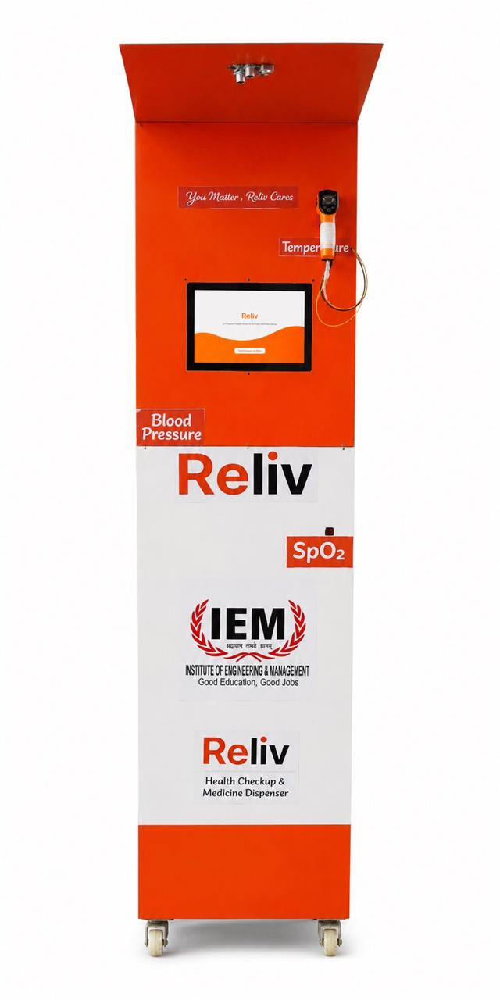
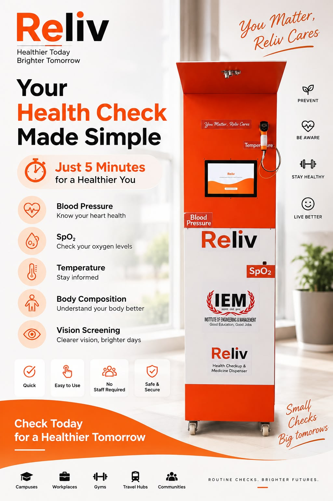

<div align="center">

# RELiV

### Healthcare, now closer to you.

**A smart preventive healthcare kiosk bringing health screening, digital wellness insights, reports, and essential medicine dispensing into one accessible experience.**

<br/>

[](https://github.com/Vaibhavcool4805/Reliv)
[](https://github.com/Vaibhavcool4805/Reliv)
[](https://github.com/Vaibhavcool4805/Reliv)
[](https://sih.gov.in/)

<br/>

<a href="https://relivkiosk.vercel.app/"><strong>🌐 Explore RELiV</strong></a>
&nbsp;&nbsp;•&nbsp;&nbsp;
<a href="#-product-demo"><strong>🎥 Watch Demo</strong></a>
&nbsp;&nbsp;•&nbsp;&nbsp;
<a href="#-documentation"><strong>📚 Documentation</strong></a>

<br/><br/>



<br/>

*Physical RELiV kiosk prototype — ready for deployment.*

</div>

---

## 🧡 The idea

Healthcare should be available where people already are.

**RELiV** is a preventive healthcare kiosk designed to make routine health screening and essential healthcare services more accessible in everyday locations such as campuses, workplaces, gyms, and community spaces.

It brings together a physical kiosk, local computing, sensor integration, a web interface, wellness-report generation, digital payments, and a medicine-dispensing workflow in one guided experience.

> **You matter. RELiV cares.**

---

## ✨ Why RELiV?

| 🩺 Accessible | ⚡ Local-first | 📄 Digital | 🔧 Modular |
|---|---|---|---|
| Designed for everyday locations where basic screening is convenient | Core kiosk workflows are designed around local operation | Reports and receipts support QR/digital delivery | Hardware, firmware, backend and intelligence can evolve independently |

---

## 🎥 Product Demo

The physical machine is the clearest way to understand RELiV.

### ▶️ Watch the Machine Demo

**[Open the full RELiV machine demonstration →](https://drive.google.com/file/d/1P1BW-T57UvRlH1Z3W7Fd4589EpWNdnWm/view?usp=drive_link)**

The full demo video is also stored in [`assets/demo/`](assets/demo/).

> If the Google Drive video does not open, set its sharing permission to **Anyone with the link → Viewer**.

---

## 🩺 What RELiV brings together

| Health Screening | Wellness Intelligence | Digital Reports | Essential Dispensing |
|---|---|---|---|
| BP, pulse, SpO₂, temperature and body metrics workflow | Plain-language wellness insights and summaries | QR/email-ready digital report experience | Payment-verified purchase and dispensing workflow |

### The patient journey

```text
Patient
   │
   ▼
┌──────────────────┐
│   RELiV KIOSK    │
│  Guided Touch UI │
└────────┬─────────┘
         │
    ┌────┴─────┐
    ▼          ▼
 Health Scan  Purchase
    │          │
    ▼          ▼
 Wellness    Payment
  Report    Verification
    │          │
    ▼          ▼
 QR / Digital  Dispense
 Delivery      + Receipt
```

---

## 🖥️ See the product

### 🌐 Live Website

**[Open the RELiV web experience →](https://relivkiosk.vercel.app/)**

### 🖼️ Product Poster



---

## 📸 Product Gallery

The repository uses real RELiV prototype and product assets rather than generated mockups.

| Physical Prototype | Health Report | Digital Receipt |
|---|---|---|
| [View machine](assets/gallery/Machine.jpeg) | [View report documentation](docs/reports/health-report.md) | [View receipt documentation](docs/reports/receipt.md) |

---

## 🧠 Health report experience

RELiV converts a screening session into a structured digital wellness report containing:

- Vital signs overview
- Body-composition metrics
- Integrated analysis cards
- Current health-status tables
- Weekly consistency confidence
- 7-day wellness journey
- QR-based report access

**[Explore the sample health report →](docs/reports/health-report.md)**

---

## 💳 Payment & dispensing

The dispensing workflow is designed around a verified transaction before fulfillment:

```text
Select item
     │
     ▼
Online payment
     │
     ▼
Server verification
     │
     ▼
Signed authorization
     │
     ▼
Kiosk verification
     │
   ┌─┴──────────┐
   ▼            ▼
Dispense      Receipt
```

The architecture includes session binding, expiry validation, one-use authorization and replay protection as part of the target secure fulfillment flow.

**[Explore the product workflow →](docs/architecture/product-workflow.md)**

---

## ⚙️ Technical Architecture

RELiV follows an **offline-first kiosk + phone bridge** concept.

```text
                         RELiV KIOSK
┌──────────────────────────────────────────────────────────────┐
│                                                              │
│   Touch UI          Raspberry Pi 5           SQLite          │
│   React       ───►  Local API / Logic  ───►  Local Data     │
│                          │                                   │
│             ┌────────────┴────────────┐                      │
│             ▼                         ▼                      │
│       ESP32-S3 / Sensors        ESP32 / Dispenser           │
│       BLE • UART                MQTT / Local messaging      │
│                                                              │
└──────────────────────────┬───────────────────────────────────┘
                           │ Local Wi-Fi
                           ▼
                    CUSTOMER PHONE
                           │
                  Mobile Internet Bridge
                           │
             ┌─────────────┴─────────────┐
             ▼                           ▼
       Payment Verification        Deferred Delivery
             │                           │
             ▼                           ▼
          Razorpay                  Report / QR flow
```

### Core technology

| Layer | Technology / Approach |
|---|---|
| Kiosk controller | Raspberry Pi 5 (4 GB) |
| Microcontrollers | ESP32 / ESP32-S3 |
| Frontend | React |
| Backend | Node.js + Express |
| Device processing | Python |
| Database | SQLite |
| Device communication | BLE · UART · MQTT |
| Payment | Razorpay verification flow |
| Deployment | Local kiosk + web/cloud components |

---

## 🔐 Security & reliability

RELiV is designed with failure-aware fulfillment and local resilience in mind.

- Session-bound authorization
- Signed payment responses
- One-use authorization consumption
- Expiry validation
- Replay protection
- Durable local logs
- Retry-safe fulfillment
- No secrets committed to the repository
- Local operation for core kiosk functions

---

## 🟢 Deployment-ready prototype

The RELiV prototype is **fully assembled and ready for deployment in suitable supervised environments**.

| Area | Status |
|---|---|
| Physical kiosk | 🟢 Ready |
| Touch UI | 🟢 Ready |
| Local backend | 🟢 Ready |
| Health screening workflow | 🟢 Ready |
| Digital health report | 🟢 Ready |
| Inventory/admin workflow | 🟢 Ready |
| Payment + dispensing flow | 🟢 Ready |
| Device communication | 🟢 Ready |
| Deployment | 🟢 Ready |

Further field validation, calibration, operational monitoring, and regulatory/permission work can continue alongside deployment.

---

## 🎯 Deployment opportunities

### 🎓 Campuses
Routine wellness checks for students and staff.

### 🏢 Workplaces
Accessible wellness stations in offices and institutions.

### 🏋️ Gyms & fitness spaces
Convenient measurements alongside regular fitness activity.

### 🏘️ Community locations
A modular platform for broader preventive-health access.

---

## 🏆 Recognition

**1st Runner-Up — Investopia, Bengal E-Summit 2026**

The project was recognized at IEM Gurukul, Kolkata, on 29–30 August 2026.

RELiV is also being developed under the **Student Innovation / Hardware** framing for Smart India Hackathon 2026.

---

## 📚 Documentation

| Resource | Description |
|---|---|
| [SIH Presentation Hub](docs/presentation/README.md) | Project presentation and technical/business context |
| [Sample Health Report](docs/reports/health-report.md) | Demonstration wellness report |
| [Sample Receipt](docs/reports/receipt.md) | Demonstration digital purchase receipt |
| [System Architecture](docs/architecture/system-architecture.md) | Architecture and data-flow notes |
| [Product Workflow](docs/architecture/product-workflow.md) | Patient and dispensing journeys |

---

## 🗂️ Repository Structure

```text
Reliv/
├── README.md
├── LICENSE
├── SECURITY.md
├── CONTRIBUTING.md
├── CHANGELOG.md
│
├── assets/
│   ├── demo/
│   ├── gallery/
│   ├── posters/
│   └── screenshots/
│
├── docs/
│   ├── architecture/
│   ├── presentation/
│   └── reports/
│
├── frontend/
├── backend/
├── hardware/
├── ai-engine/
└── firmware/
```

---

## 🚀 Roadmap

### Next stage
- [ ] Supervised field deployment
- [ ] Reference-device comparison and calibration documentation
- [ ] Pilot usability measurements
- [ ] Operational monitoring and maintenance workflow
- [ ] Broader institutional deployment

---

## ⚠️ Responsible Use

RELiV is a preventive-health and wellness platform. Screening outputs and generated summaries are not a substitute for professional medical diagnosis, treatment, or emergency care.

Clinical validation, calibration, applicable regulatory/permission requirements, privacy controls, safe medicine-handling procedures, and supervised operational practices should be maintained for real-world deployment.

Sample documents should use anonymized or synthetic information before public distribution.

---

## 🤝 Contributing

Ideas, technical improvements, hardware integration work, UX feedback, testing strategies and documentation improvements are welcome.

See [CONTRIBUTING.md](CONTRIBUTING.md) for the contribution workflow.

---

## 📜 License

See [LICENSE](LICENSE).

---

<div align="center">

# RELiV

### Preventive healthcare, closer to everyday life.

[🌐 Explore RELiV](https://relivkiosk.vercel.app/) · [🎥 Watch the Demo](https://drive.google.com/file/d/1P1BW-T57UvRlH1Z3W7Fd4589EpWNdnWm/view?usp=drive_link) · [💻 View Repository](https://github.com/Vaibhavcool4805/Reliv)

**You matter. RELiV cares.**

</div>
