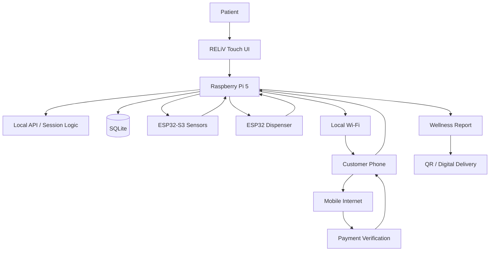

# RELiV System Architecture

RELiV is designed around an **offline-first kiosk** with a phone bridge for services that require external connectivity.

## System overview

For a cleaner product-level view, see the [System Overview diagram](system-overview.md).

## Core components

- **Raspberry Pi 5:** local kiosk controller.
- **React:** touch-oriented user interface.
- **Node.js / Express:** local APIs and session/business logic.
- **Python:** measurement processing and device integration.
- **ESP32 / ESP32-S3:** sensor and dispensing interfaces.
- **SQLite:** local inventory, prices and application data.
- **BLE / UART / MQTT:** device communication paths.
- **Phone bridge:** provides mobile connectivity for payment and deferred delivery workflows.

## Payment authorization flow

1. Create a kiosk session.
2. Bind the purchase request to the session, service and amount.
3. Verify payment through the server-side payment flow.
4. Return a signed, one-use authorization with an expiry.
5. Verify the authorization locally at the kiosk.
6. Reject expired or replayed authorizations.
7. Consume the authorization before fulfillment.
8. Generate the dispensing result and receipt.

The prototype is complete and ready for deployment. Deployment-specific validation, calibration, privacy controls and operational requirements should be handled according to the environment in which the kiosk is installed.
