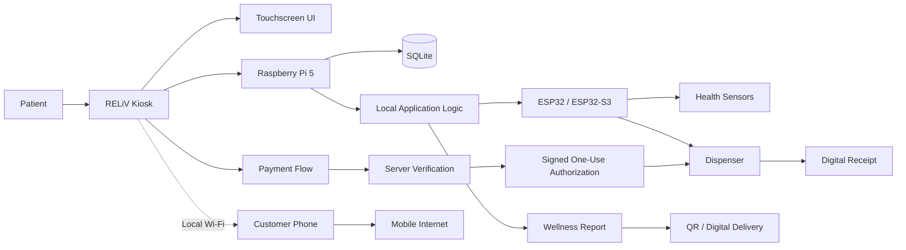

# RELiV System Overview

## Architecture principles

- **Local-first:** core kiosk workflows are designed to remain operational locally.
- **Modular:** hardware, device communication, application logic and reporting are separated into clear layers.
- **Verified fulfillment:** payment verification precedes dispensing.
- **Digital delivery:** reports and receipts are designed for QR/digital access.
