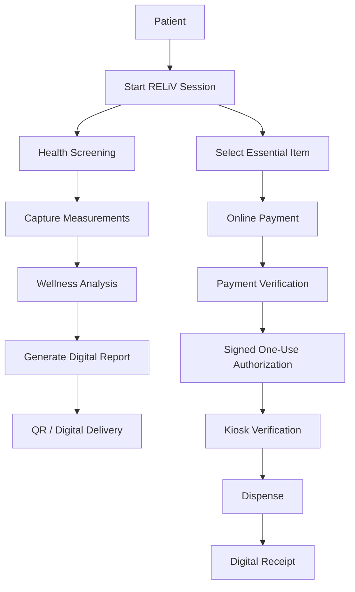

# RELiV Product Workflow

## End-to-end experience

**Screen → Understand → Pay → Verify → Dispense → Receive**

The screening and dispensing journeys remain distinct while sharing the same guided kiosk experience.
